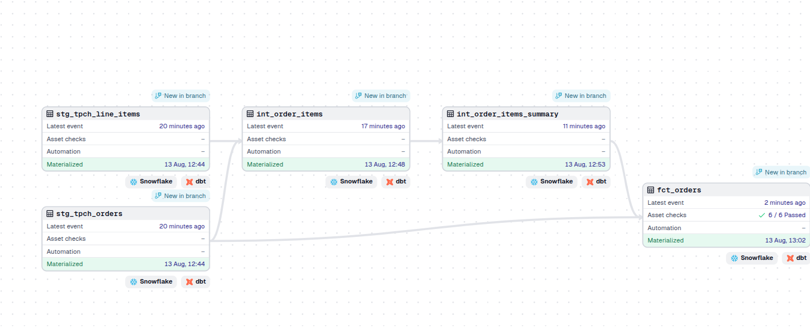

# ELT pipeline with snowflake, dbt & airflow

This is an ELT pipeline built with  
    - dbt: transformation
    - snowflake: data warehouse
    - airflow: orchestration

## dbt project folder structure

1. Models: Here is where your SQL code goes to query and model your data. We use two folders:  
    - staging: contains queries drawing directky from source files  
    - mart: models output from staging creating fact table  
2. Macros contain re-usable SQL commands  
3. Seeds is for static files such as exel files that do not change often  
4. Snapshot is for creating incremental models  
5. Tests is for generic (live within model folder) or singular test that live in `tests/`  
6. dbt_packages that contain third party libraries defined in `packages.yml`

## Setup
Start a virtual environment: python3 -m venv <env-name> and activate 
Install dbt: pip install dbt-snowflake  
With your snowflake account created, create respective warehous, database, schema and roles  
Start dbt project: dbt init and follow through the steps 
Configure `dbt_project.yml` file (tells dbt where to look for your models), and `package.yml` for third-party dependencies 
Write up your scripts for models and tests and run with `dbt run` or `dbt test`. 

